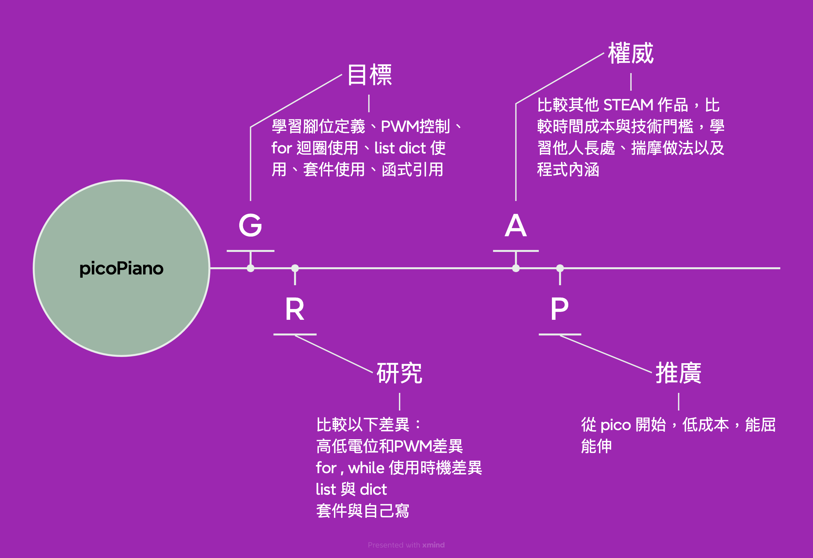

# 利用紙卡片製作平台鋼琴
1. 學習地圖

1. Thonny 下載
1. 韌體安裝
1. 銲接蜂鳴器、接地線、了解基本 io
1. 完成紙卡片
# 成品演示  

# 程式使用
1. 板上LED開關
2. 閃爍
3. 蜂鳴器控制，僅高低電位
4. PWM控制蜂鳴器
5. 寫一個中音 Do
6. 用字典的方法來索引音階
7. 安裝 picozero，寫頻率、秒數
8. 以 note 標注頻率
9. 設定 tempo
10. list 寫法
11. 以 BPM 表達時間
12. list 斷行呈現方式
13. 隨機
14. 隨機選取音階
15. for 迴圈隨機選音階
16. for 迴圈隨機播音階
17. 小節播放
18. if 按鈕 按下，則播放某音階
19. 開機後亮燈、播放隨機音樂後可按琴鍵，最後存成 mai
20. 利用 exec 將字串當成程式碼來執行，定義腳位、if 按鈕按下時都可以 for loop 來表示
21. 觀察按鈕與音頻高低的規則，利用 midi 編號轉至音高
22. 精簡的表達（連續 midi 編碼含半音，非全音）
23. 加入可改大調
1. 利用GPT共編曲
1. 完成編曲範例
1. 播放一首曲目後，再進入彈奏模式
1. 若按下 gp14 , 15 進入演奏模式，若不按則為彈奏模式
1. 完成十首的範例